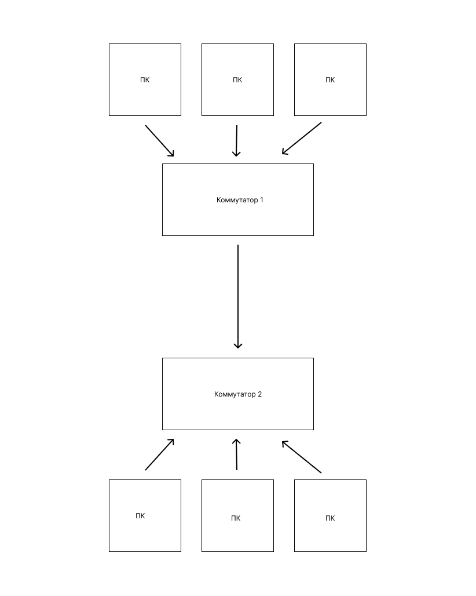

# Домашее задание от 09.09

## Схема MAC-адресов

|Компьютер   |   MAC-адрес |
|--- |---|
|ПК-1         |  00:1A:2B:3C:4D:01 |
|ПК-2         |  00:1A:2B:3C:4D:02 |
|ПК-3         |  00:1A:2B:3C:4D:03 |
|ПК-4         |  00:1A:2B:3C:4D:04 |
|ПК-5         |  00:1A:2B:3C:4D:05 |
|ПК-6         |  00:1A:2B:3C:4D:06 |

